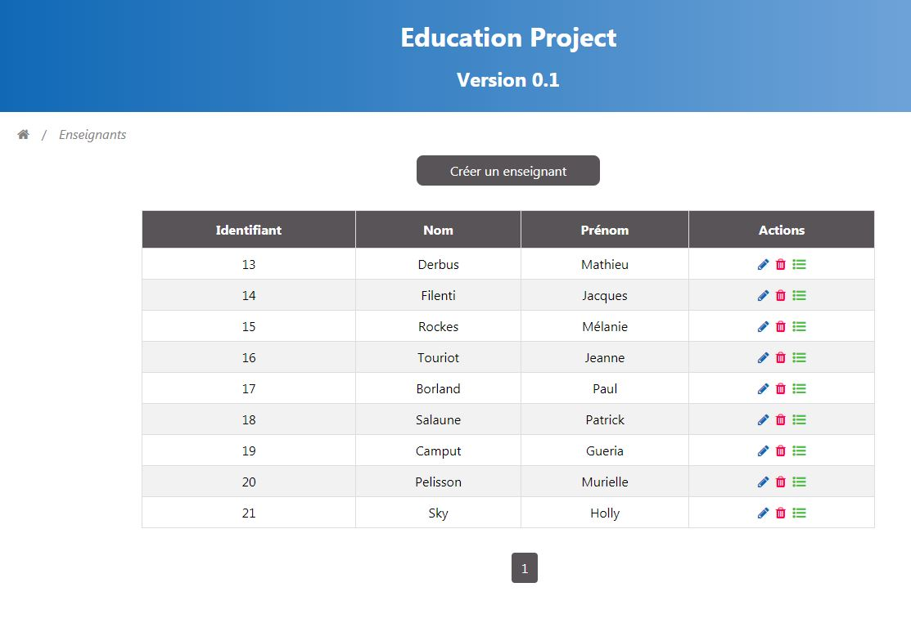

## Introduction

Education Project est un logiciel réalisé à destination des équipes enseignantes (écoles primaires, collèges, lycées) afin
de leur faciliter leurs tâches quotidiennes (gestion de plannings, gestion de fiches...).


## Prérequis

Pour faire fonctionner Education Project, vous devez avoir à minima :

* Avoir installer JDK14 et une JRE Java (https://adoptopenjdk.net/index.html?variant=openjdk14&jvmVariant=hotspot)
* Disposer de Maven
* Une base de données PostGreSQL 12 ou MySQL 8/MariaDB (https://www.postgresql.org/download/ - https://dev.mysql.com/downloads/ - https://mariadb.org/download/)
* Base de données avec tables préalablement créées (voir répertoire backend/sql/scripts)
* NodeJS
* Les variables d'environnement URL_DB, USER_DB, PASSWORD_DB, DRIVER_DB initialisés

DRIVER_DB : Nom du driver JDBC, exemple : org.postgresql.Driver pour PostGreSQL, com.mysql.cj.jdbc.Driver pour MySQL/MariaDB

URL_DB : URL de la base de données, exemple : jdbc:postgresql://localhost:5432/educationproject

USER_DB : Identifiant du compte utilisateur de la base de données

PASSWORD_DB : Mot de passe du compte utilisateur de la base de données

[Variables d'environnement sous Windows](https://www.malekal.com/variables-environnement-windows/)

[Variables d'environnement sous Linux - 1](https://buzut.net/maitriser-les-variables-d-environnement/)
[Variables d'environnement sous Linux - 2](https://doc.ubuntu-fr.org/variables_d_environnement)

* La partie backend écrite en java doit être démarrée avant la partie frontend.

Nous vous recommandons d'installer le logiciel sur un serveur Web (Nginx / Apache). Il existe plusieurs ressources sur Internet vous décrivant comment installer une application Web sur un serveur Web en attendant un script automatique de notre part pour installer EducationProject.

## Démarrage de l'application

Si le logiciel est installé sur un serveur Web, il vous suffit de saisir l'URL que l'administrateur système vous
fournira après son installation. Cette URL est à saisir au niveau de votre navigateur Internet.

Si le logiciel ne dépend pas d'un serveur Web, vous pouvez "simuler" le serveur Web en utilisant nodeJS :

```bash
serve -s build
```

## Définitions

| Terme | Définition |
|-------|------------|
|  Classe     |  Groupe d'élèves de même niveau scolarisé pendant une même année scolaire |
|  Créneau horaire     | Intervalle heure de début et heure de fin, Exemple : 8H - 9H |
| Enseignant      | Personnage chargée de donner un cours |
|  Matière     | Discipline faisant l'objet d'un enseignement |
|  Emploi du temps     | Planning permettant à l'élève ou à l'enseignant de connaître le programme de la semaine |
| Salle      | Pièce dans laquelle se déroule un cours |
| Slot      | Emplacement délimité par un créneau horaire dans un planning regroupant la matière, la salle, l'enseignant |

## Tutorial : Création d'un planning

Dans ce tutorial, nous allons apprendre à créer un simple Planning pour une classe de collège.

### Première étape : la création d'une classe

Pour commencer, nous allons créer une classe en cliquant sur le menu "Classes" puis en cliquant sur le bouton
"Créer une classe". Un formulaire apparaît, il suffit de le compléter afin de créer une classe. Pour notre exemple,
nous allons créer une classe de 6ème...


### Deuxième étape : La création de matières

Nous retournons à la page principale de l'application pour ensuite cliquer sur le menu "Matières" puis sur le bouton
"Créer une matière". Un formulaire apparaît avec quelques informations à saisir... 

Les matières que nous avons créé pour ce tutorial sont les suivantes : 


### Troisième étape : La création d'enseignants (facultative)

La création d'enseignants est faculative, si vous ne désirez pas afficher le nom de l'enseignant au niveau de
l'emploi du temps, vous pouvez passer cette étape.

Pour créer des enseignants, il faut revenir à la page principale de l'application, sélectionner le menu "Enseignants"
puis appuyer sur le bouton "Créer un enseignant". Un formulaire apparaît ensuite avec quelques informations à saisir...

Les enseignants que nous avons créé pour ce tutorial sont les suivants :



### Quatrième étape : La création de salles (facultative)

La création de salles est faculative, si vous ne désirez pas afficher le nom de la salle au niveau de
l'emploi du temps, vous pouvez passer cette étape.

Pour créer des salles, il faut revenir à la page principale de l'application, sélectionner le menu "Salles"
puis appuyer sur le bouton "Créer une salle". Un formulaire apparaît ensuite avec quelques informations à saisir...

Les salles que nous avons créé pour ce tutorial sont les suivantes :


### Cinquième étape : La création de créneaux horaires

Voici une étape cruciale : Les créneaux horaires. Chaque cours exprimé sur un emploi du temps est relié
à un créneau horaire. En effet, un cours se produit entre deux heures... Nous partons sur un emploi du temps
classique entre 8H00 et 17H00 (si vous désirez changer les limites horaires d'un planning, le menu "Options" est
à votre disposition).

Pour créer des créneaux horaires, rendez-vous à la page principale de l'application, sélectionner le menu
"Créneaux horaires" puis appuyer sur le bouton "Créer un créneau horaire". Un formulaire apparaît ensuite avec quelques
informations à saisir...

Les créneaux horaires que nous avons créé pour ce tutoriel sont les suivants :


### Sixième étape : La création des slots du planning

Il est temps de mélanger toutes les notions précédentes que nous avons créer pour former un seul
et même objet nommé slot. C'est le slot qui contient le nom d'une matière, le nom d'un enseignant,
le nom de la salle et bien d'autres informations au niveau d'un emploi du temps.

Pour créer des slots, cliquer sur le menu "Slots" au niveau de la page principale de l'application puis appuyer
sur le bouton "Créer un slot". Un formulaire apparaît ensuite avec quelques informations à saisir...

Les slots que nous avons crée pour ce tutorial sont les suivants :


### Dernière étape : La création de l'emploi du temps

Retournez à la page d'accueil, sélectionnez le menu Emplois du temps puis cliquez sur le bouton créer un emploi du temps.
Il vous suffit ensuite d'associer tous les slots et la classe au planning que vous souhaitez créer.

Exemple utilisé pour le tutorial :


Pour voir votre planning généré, il suffit de cliquer sur le bouton détails de couleur vert :


